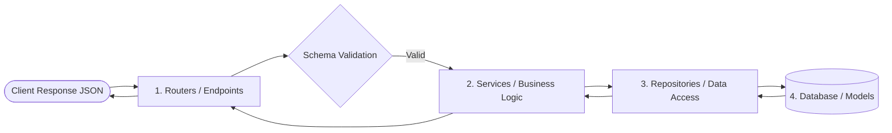

<div align="center">

# ⚡ FastAPI Enterprise Starter & Architecture Guide

<p align="center">
  <strong>A modern, high-performance, and scalable RESTful API foundation built with FastAPI, Pydantic, and SQLAlchemy.</strong>
</p>

<p align="center">
  <a href="https://fastapi.tiangolo.com/"></a>
  <a href="https://www.python.org/"></a>
  <a href="https://www.uvicorn.org/"></a>
  <a href="https://docs.pydantic.dev/"></a>
  <a href="https://www.sqlalchemy.org/"></a>
  <a href="https://github.com/saurabhxcod/fastAPI/blob/main/LICENSE"></a>
</p>

<p align="center">
  <a href="#-features">Features</a> •
  <a href="#-quick-start">Quick Start</a> •
  <a href="#-api-entry-point--endpoints">API & Endpoints</a> •
  <a href="#-production-architecture">Production Architecture</a> •
  <a href="#-interactive-documentation">Interactive Docs</a> •
  <a href="#-tech-stack">Tech Stack</a>
</p>

---

</div>

## 📖 Overview

This repository provides a clean, modular, and production-ready **FastAPI** backend setup. It starts with foundational API routing and scales into an enterprise-grade, layered software architecture with separation of concerns: **Routers**, **Services**, **Repositories**, **Schemas**, **Models**, and **Core** configurations.

---

## ✨ Features

- 🚀 **Blazing Fast**: Asynchronous request handling powered by Starlette and Pydantic.
- 📐 **Clean Architecture**: Decoupled layered design (Repository & Service patterns) ready for enterprise scale.
- 🛡️ **Type Safety & Data Validation**: Robust request/response validation with Pydantic models.
- 🔐 **Security Ready**: Prepped for token authentication (`python-jose`) and modern password hashing (`argon2-cffi`).
- 🗄️ **Database Agnostic ORM**: SQLAlchemy integration for clean database models and transactions.
- 📚 **Self-Documenting**: Interactive OpenAPI (Swagger UI) and ReDoc generated automatically.
- 🔄 **Hot Reloading**: Instant feedback loop during development with Uvicorn.

---

## 🚀 Quick Start

Follow these steps to set up and run the application locally in seconds.

### 1. Clone the Repository

```bash
git clone https://github.com/saurabhxcod/fastAPI.git
cd fastAPI
```

### 2. Create and Activate a Virtual Environment

```bash
# Create virtual environment
python3 -m venv venv

# Activate on macOS / Linux
source venv/bin/activate

# Activate on Windows (Command Prompt)
# .\venv\Scripts\activate.bat

# Activate on Windows (PowerShell)
# .\venv\Scripts\Activate.ps1
```

### 3. Install Dependencies

```bash
pip3 install -r requirements.txt
```

Verify your installed packages:
```bash
python -m pip list
```

### 4. Run the Development Server

You can launch the server using **Uvicorn** with hot-reload enabled:

```bash
uvicorn app.main:app --reload
```

Or run the entry script directly:

```bash
python app/main.py
```

The API will now be live at:
👉 **`http://127.0.0.1:8000`**

---

## 🚪 API Entry Point & Endpoints

The application bootstrap lives in **`app/main.py`**, acting as the root entry point:

```python
from fastapi import FastAPI
from .schemas.api import ApiResponse

app = FastAPI(
    title="FastAPI Application",
    description="High-performance REST API built with FastAPI",
    version="1.0.0"
)

@app.get("/", response_model=ApiResponse)
def home():
    """Root endpoint returning standardized API status response"""
    return ApiResponse(message="Welcome to API", success=True, status="OK")

@app.get("/about")
def about():
    return {"message": "This is an about page"}

@app.get("/contact")
def contact():
    return {"message": "This is a contact page"}

@app.get("/get-users")
def get_users():
    return ["Saurabh", "Amit", "Abhishek", "Abhi"]
```

### 🌐 Endpoints Summary

| Method | Endpoint | Description | Sample Response |
| :--- | :--- | :--- | :--- |
| `GET` | `/` | API status & welcome payload | `{"message": "Welcome to API", "success": true, "status": "OK"}` |
| `GET` | `/about` | About page metadata | `{"message": "This is an about page"}` |
| `GET` | `/contact` | Contact details & info | `{"message": "This is a contact page"}` |
| `GET` | `/get-users` | List of demo users | `["Saurabh", "Amit", "Abhishek", "Abhi"]` |

---

## 🏗️ Production Architecture

To scale beyond a single file, this project follows an industry-standard **Separation of Concerns (SoC)** and **Layered Clean Architecture**:

```
fastAPI/
├── app/
│   ├── main.py              # 🚀 Application entry point & FastAPI instance
│   │
│   ├── core/                # ⚙️ Global configurations & utilities
│   │   ├── config.py        # Environment variables & application settings
│   │   ├── database.py      # Database engine, connection pooling, and sessionmaker
│   │   └── security.py      # Password hashing, JWT tokens, and OAuth2 utilities
│   │
│   ├── routers/             # 🔀 API Routing system (Endpoints & Controllers)
│   │   ├── __init__.py
│   │   ├── v1/              # API Versioning (e.g., /api/v1/...)
│   │   ├── users.py         # User-related routes
│   │   └── auth.py          # Authentication routes
│   │
│   ├── schemas/             # 📋 Data Contracts (Pydantic Models)
│   │   ├── api.py           # Standard API response schemas
│   │   └── user.py          # Request & Response body validations (DTOs)
│   │
│   ├── models/              # 🗄️ Database ORM Models (SQLAlchemy entities)
│   │   ├── base.py          # Base declarative class with timestamps
│   │   └── user.py          # User table schema definition
│   │
│   ├── repositories/        # 💾 Data Access Layer (CRUD & DB queries)
│   │   ├── base.py          # Generic repository with common DB operations
│   │   └── user_repo.py     # User-specific query operations
│   │
│   └── services/            # 🧠 Business Logic Layer
│       └── user_service.py  # Business rules, transformations, and orchestration
│
├── requirements.txt         # Project dependencies
├── .gitignore               # Git ignored directories and files
└── README.md                # Project documentation
```

### 🔍 Layer Responsibilities



| Layer | Directory | Description & Purpose |
| :--- | :--- | :--- |
| **1. Routers** | `app/routers/` | **Routing System**: Handles HTTP verbs, URL paths, request parameter binding, response codes, and connects requests to services. |
| **2. Services** | `app/services/` | **Business Logic Layer**: Implements business rules, orchestrates operations, handles side-effects (e.g., sending emails), independent of database technology. |
| **3. Repositories** | `app/repositories/` | **Data Access Layer**: Direct database queries, joins, and CRUD operations using SQLAlchemy sessions. Isolates DB logic from business rules. |
| **4. Schemas** | `app/schemas/` | **Request/Response Contracts**: Pydantic models for strict input validation, type coercion, and serialization. |
| **5. Models** | `app/models/` | **Database Structure**: SQLAlchemy table definitions defining columns, relationships, foreign keys, and indexes. |
| **6. Core** | `app/core/` | **Configurations & Helpers**: Database engine setup, environment configurations, security/JWT utilities, and dependency injection helpers. |

---

## 📑 Interactive Documentation

FastAPI generates automated, interactive API documentation out of the box:

- **Swagger UI**: [http://127.0.0.1:8000/docs](http://127.0.0.1:8000/docs)
  - Test endpoints interactively from your browser with built-in schema exploration.
- **ReDoc**: [http://127.0.0.1:8000/redoc](http://127.0.0.1:8000/redoc)
  - Clean, responsive, and organized API reference documentation.

---

## 🛠️ Tech Stack & Dependencies

| Technology | Purpose |
| :--- | :--- |
| [FastAPI](https://fastapi.tiangolo.com/) | Modern, fast web framework for building APIs with Python |
| [Uvicorn](https://www.uvicorn.org/) | Lightning-fast ASGI web server implementation |
| [Pydantic](https://docs.pydantic.dev/) | Data validation and settings management using Python type annotations |
| [SQLAlchemy](https://www.sqlalchemy.org/) | Python SQL toolkit and Object Relational Mapper (ORM) |
| [python-jose](https://github.com/mpdavis/python-jose) | JSON Web Token (JWT) encoding and decoding implementation |
| [Argon2-cffi](https://argon2-cffi.readthedocs.io/) | Secure password hashing algorithm for authentication |

---

## 🧑‍💻 Contributing & Development Workflow

1. **Fork the Project**
2. **Create your Feature Branch** (`git checkout -b feature/AmazingFeature`)
3. **Commit your Changes** (`git commit -m 'Add some AmazingFeature'`)
4. **Push to the Branch** (`git push origin feature/AmazingFeature`)
5. **Open a Pull Request**

---

## 📄 License

Distributed under the **MIT License**. See `LICENSE` for more information.

<div align="center">

Made with ❤️ by [Saurabh](https://github.com/saurabhxcod)

</div>
